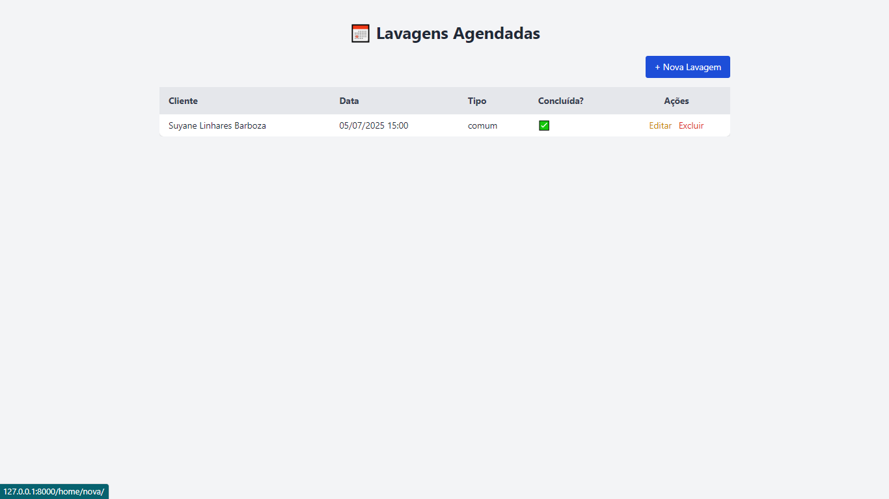

# 🧼 Sistema de Agendamento de Lavagens

Este é um sistema simples de **agendamento de lavagens automotivas**, desenvolvido em **Django** com **interface em HTML + Tailwind CSS**. Ele permite realizar operações de **CRUD (Create, Read, Update, Delete)** para lavagens e clientes.

---

## ✅ Funcionalidades

- Listagem de lavagens agendadas  
- Cadastro de novas lavagens  
- Edição e conclusão de lavagens  
- Exclusão de lavagens  
- Seleção de clientes cadastrados  
- Interface responsiva e moderna com Tailwind CSS

---

## 💻 Tecnologias utilizadas

- **Python 3.11+**
- **Django 4.x**
- **MySQL** (ou SQLite para testes)
- **Tailwind CSS** (via CDN)

